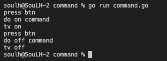

# Command 

>Behavioral Patterns

```
Bir isteği, istekle ilgili tüm bilgileri içeren bağımsız bir nesneye dönüştürür.
Bu dönüştürme, istekleri bir yönteme bağımsız değişken olarak iletmemize, bir isteğin yürütülmesini geciktirmemize veya sıraya koymamıza olanak tanır.
```

# Output
<p>
    

</p>