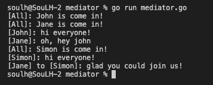

# Mediator 

>Behavioral Patterns

```
Nesneler arasındaki kaotik bağımlılıkları azaltmayı sağlar. Doğrudan iletişimi kısıtlar ve onları yalnızca bir aracı nesne aracılığıyla işbirliği yapmaya zorlayan tasarım desenidir.
```

# Output
<p>
    

</p>