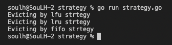

# Strategy 

>Behavioral Patterns

```
Bir algoritma ailesi oluşturup her birini farklı sınıfa yerleştirerek nesnelerini birbiri arasında değişebilir hale getirmeyi sağlayan bir tasarım desenidir.
```

# Output
<p>
    

</p>