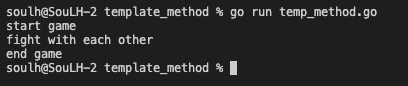

# Template Method 

>Behavioral Patterns

```
Üst sınıfdaki bir algoritmanın iskeletini tanımlar ancak alt sınıfların yapısını değiştirmeden algoritmanın belirli adımlarını geçersiz kılmasına izin verir.
```

# Output
<p>
    

</p>