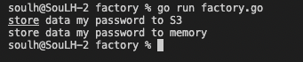

# Factory 

>Creational Patterns

```
Üst sınıfa nesneler oluşturmak için bir arabilirm sağlar. Alt sınıfları oluşturacak nesnelerin türünü değiştirmesine de izin verir.
```

# Output
<p>
    

</p>